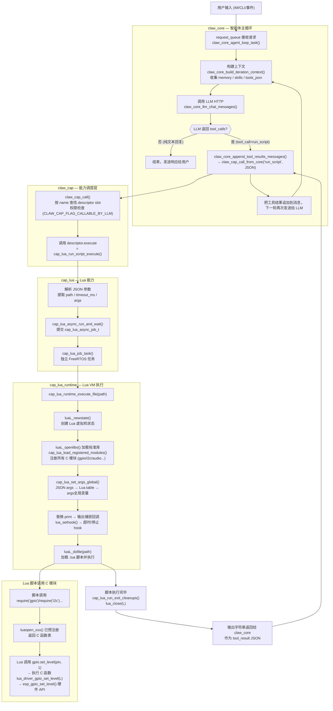

# 智能体生成 Lua 脚本到 C 程序执行链路

## 流程图



---

## 各阶段详细说明

### 1. LLM 决策生成 `tool_call`

- `components/claw_modules/claw_core/src/claw_core_agent_loop.c` 的主循环在调用 LLM 前，通过 `claw_cap_build_llm_tools_json()` 把所有注册的 capability（包括 `run_script`、`run_script_async`）序列化为 JSON schema 发给 LLM。
- LLM 决定执行 Lua 脚本时，返回形如以下结构的 tool_call：

```json
{
  "name": "run_script",
  "input": {
    "path": "/fatfs/scripts/xxx.lua",
    "args": { "key": "value" }
  }
}
```

### 2. 能力调度 (`claw_cap`)

- `components/claw_modules/claw_cap/src/claw_cap.c` 的 `claw_cap_call_from_core()` → `claw_cap_call()` 根据名字在 descriptor 表里查找，做权限校验（是否标记 `CLAW_CAP_FLAG_CALLABLE_BY_LLM`），然后调用 `descriptor.execute`。

### 3. Lua 能力入口 (`cap_lua`)

- `components/claw_capabilities/cap_lua/src/cap_lua.c` 的 `cap_lua_run_script_execute()` 解析 JSON，构造 `cap_lua_async_job_t`，调用 `cap_lua_async_run_and_wait()` 同步等待结果。
- `run_script_async` 则不等待，立即返回 job_id，脚本在后台运行。

### 4. FreeRTOS 异步任务 (`cap_lua_async`)

- `components/claw_capabilities/cap_lua/src/cap_lua_async.c` 的 `cap_lua_job_task()` 是独立 FreeRTOS 任务，分配输出缓冲区后调用 `cap_lua_runtime_execute_file()`。

### 5. Lua VM 真正执行 (`cap_lua_runtime`)

- `components/claw_capabilities/cap_lua/src/cap_lua_runtime.c` 的 `cap_lua_runtime_execute_file()` 完成以下工作：

| 步骤 | 调用 | 说明 |
|------|------|------|
| 1 | `luaL_newstate()` | 创建 Lua 5.5 VM 状态（来自 `georgik/lua` 组件） |
| 2 | `luaL_openlibs()` | 加载 Lua 标准库 |
| 3 | `cap_lua_load_registered_modules()` | 逐个调用各 C 模块的 `luaopen_xxx()` 注册到 VM |
| 4 | `cap_lua_set_args_global()` | 把 JSON args 递归转换成 Lua table 赋给全局 `args` |
| 5 | 替换 `print` | 用捕获输出的闭包覆盖，所有 print 输出写入 output buffer |
| 6 | `lua_sethook()` | 注册超时/停止检查钩子（每 100 条指令触发一次） |
| 7 | `luaL_dofile()` | 加载并执行 `.lua` 文件 |

### 6. Lua 回调 C 硬件模块

- 脚本中 `require("gpio")` 调用预注册的 `luaopen_gpio()`，返回包含 C 函数指针的 Lua table。
- 调用链示例：

```
Lua: gpio.set_level(2, 1)
  → Lua VM 查找 gpio 模块 C 函数表
  → lua_driver_gpio_set_level(lua_State *L)         [components/lua_modules/lua_driver_gpio/]
  → esp_gpio_set_level(gpio_num, level)              [ESP-IDF GPIO API]
  → 硬件寄存器写入
```

### 7. 结果回传

- 脚本里所有 `print()` 的输出被捕获到 output buffer，脚本结束后作为 tool_result 字符串返回。
- `claw_core` 把这个结果追加到消息历史，再次调用 LLM，LLM 基于执行结果生成下一步动作或最终回复用户。

---

## 关键源文件索引

| 文件 | 职责 |
|------|------|
| `components/claw_modules/claw_core/src/claw_core_agent_loop.c` | 智能体主循环，LLM 调用与 tool_call 分发 |
| `components/claw_modules/claw_cap/src/claw_cap.c` | 能力注册、调度、权限控制 |
| `components/claw_capabilities/cap_lua/src/cap_lua.c` | Lua 能力描述符，`run_script` / `run_script_async` 入口 |
| `components/claw_capabilities/cap_lua/src/cap_lua_async.c` | FreeRTOS 异步 job 管理，环形日志缓冲 |
| `components/claw_capabilities/cap_lua/src/cap_lua_runtime.c` | Lua VM 生命周期，模块加载，超时钩子，文件执行 |
| `components/lua_modules/lua_driver_*/` | 各硬件外设的 Lua→C 绑定模块 |
| `components/lua_modules/lua_module_*/` | 音频、显示、BLE 等高级功能模块 |
| `components/common/app_claw/app_lua_modules.c` | 应用层 Lua 模块注册入口 |
