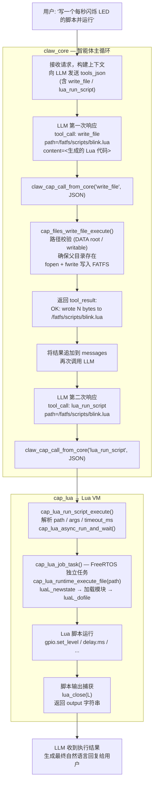
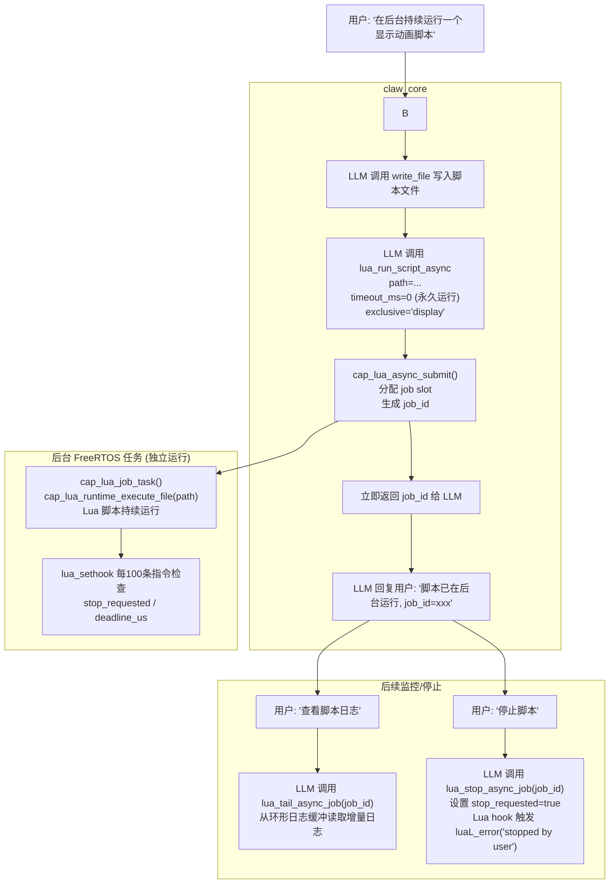
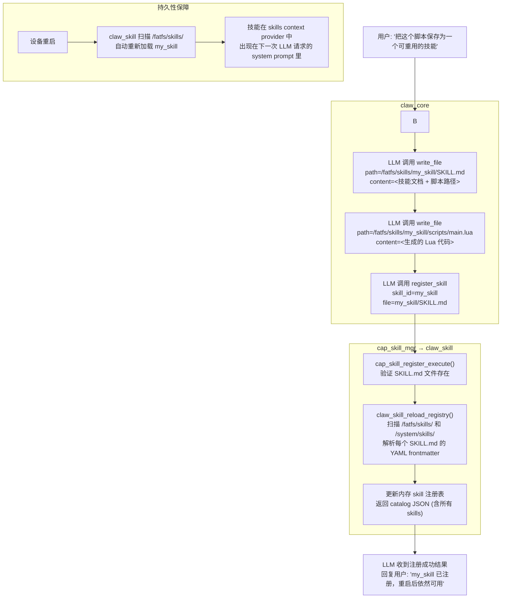

# LLM 生成 Lua 脚本并固化到设备端的链路

## 支持情况

**完全支持。** 该工程通过 `write_file` + `lua_run_script` / `lua_run_script_async` 这组能力的组合，实现了 LLM 动态生成 Lua 脚本、写入设备持久存储、立即执行的完整闭环。此外还支持通过 `write_file` + `register_skill` 将脚本打包为 Skill，使其在设备重启后依然持久可用。

---

## 路径一：LLM 生成脚本 → 写入 → 立即运行



---

## 路径二：LLM 生成脚本 → 写入 → 异步后台运行



---

## 路径三：LLM 生成脚本 → 写入 → 注册为 Skill（永久固化）



---

## 关键约束与安全机制

### 文件路径沙箱 (`cap_files`)

| 根路径 | 来源 | 可写 | 说明 |
|--------|------|------|------|
| `CLAW_PATH_DATA`（`/fatfs` 或 SD 卡） | `claw_paths` 动态获取 | **是** | 脚本、技能文件写入此处 |
| `CLAW_PATH_SYSTEM`（`/system`） | 固件只读分区 | **否** | 禁止 LLM 写入固件内容 |

- 路径必须绝对路径，不能含 `..`
- `cap_files_path_is_writable()` 在写入前强制检查
- 自动创建中间目录（`cap_files_ensure_parent_dirs`）

### Lua 执行安全

| 机制 | 实现位置 | 说明 |
|------|----------|------|
| 超时保护 | `lua_sethook` 每 100 条指令触发 | 超过 `deadline_us` 自动报错退出 |
| 协作停止 | `stop_requested` 标志 | 用户随时可通过 `lua_stop_async_job` 中断 |
| 输出大小限制 | `CAP_LUA_OUTPUT_SIZE` | 脚本输出有上限，超出截断 |
| 脚本大小限制 | `CAP_LUA_MAX_SCRIPT_SIZE` | 拒绝过大的脚本文件 |

### 技能注册条件

- `register_skill` 要求 `SKILL.md` 文件已在 DATA root 下物理存在才能注册
- `unregister_skill` 拒绝操作 `manage_mode=readonly` 的固件内置技能
- 注册成功后 `claw_skill_reload_registry()` 立即更新内存，当前会话下次请求即可看到新技能

---

## 典型完整交互序列

```
用户: "帮我写一个Lua脚本控制GPIO 2每秒闪烁，保存为技能"

LLM tool_call [1]: write_file
  path    = /fatfs/skills/led_blink/SKILL.md
  content = ---\nid: led_blink\nsummary: LED blink...\n---\n# LED Blink Skill\n...

LLM tool_call [2]: write_file
  path    = /fatfs/skills/led_blink/scripts/blink.lua
  content = local gpio = require("gpio")\n...

LLM tool_call [3]: register_skill
  skill_id = led_blink
  file     = led_blink/SKILL.md

LLM tool_call [4]: lua_run_script_async
  path      = /fatfs/skills/led_blink/scripts/blink.lua
  name      = led_blink
  exclusive = gpio_control

→ 设备端 LED 开始闪烁，技能永久保存，重启后自动恢复。
```

---

## 关键源文件索引

| 文件 | 职责 |
|------|------|
| `components/claw_capabilities/cap_files/src/cap_files.c` | `write_file` 等文件操作能力，路径沙箱，写权限控制 |
| `components/claw_capabilities/cap_lua/src/cap_lua.c` | `lua_run_script` / `lua_run_script_async` 能力描述符和入口 |
| `components/claw_capabilities/cap_lua/src/cap_lua_async.c` | 异步 job 管理，停止信号，环形日志缓冲 |
| `components/claw_capabilities/cap_lua/src/cap_lua_runtime.c` | Lua VM 生命周期，超时钩子，文件执行 |
| `components/claw_capabilities/cap_skill_mgr/src/cap_skill_mgr.c` | `register_skill` / `unregister_skill` 能力，Skill 注册/注销 |
| `components/claw_modules/claw_skill/src/claw_skill.c` | Skill 注册表扫描，`SKILL.md` frontmatter 解析，DATA/SYSTEM 双根扫描 |
| `components/claw_modules/claw_cap/src/claw_cap.c` | 能力调度、权限控制（`CLAW_CAP_FLAG_CALLABLE_BY_LLM`） |
| `components/claw_modules/claw_core/src/claw_core_agent_loop.c` | 智能体主循环，多轮 tool_call 迭代 |
